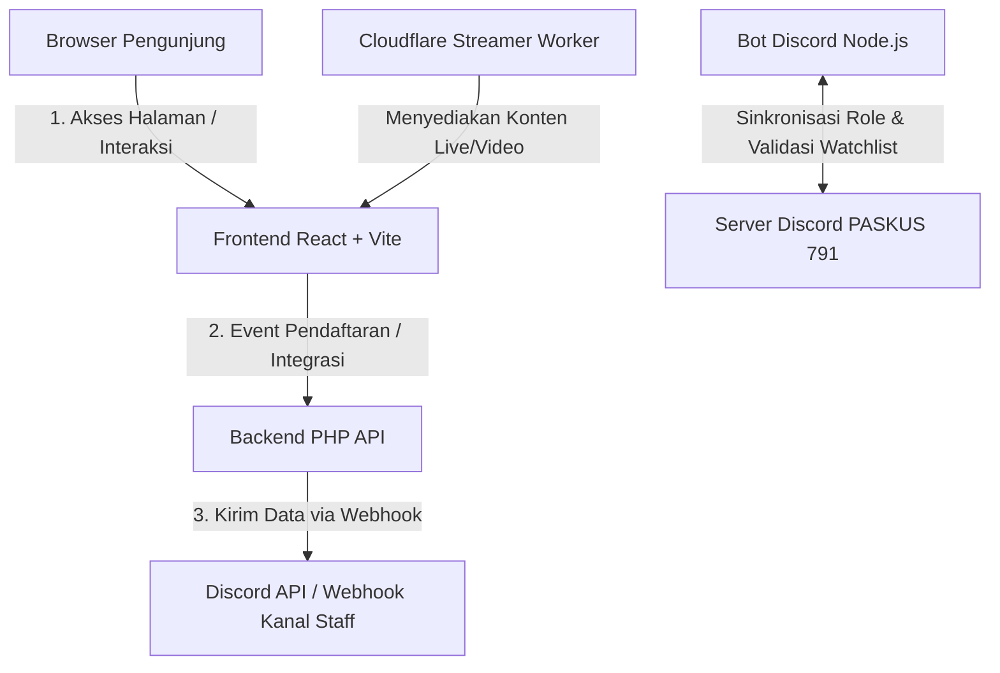

# Dokumentasi Proyek Website PASKUS 791

Project ini adalah portal utama komunitas PASKUS 791 (Resimen So-791) untuk game *Blackhawk Rescue Mission 5* (BRM5) roleplay Indonesia. Portal ini mengintegrasikan profil publik, regulasi kesatuan, manajemen unit tempur, pusat konten streamer, serta alur pendaftaran personel baru (*enlistment*) yang terhubung langsung dengan Discord.

> "yerikho for developer selanjutnya waktu saya bikin ini hanya saya dan Tuhan yang tahu program nya dan sekarang hanya Tuhan yang tau, jadi klo aman lanjutkan perjuangan ini."

---

## 🛠️ Arsitektur Sistem & Alur Aplikasi

Aplikasi ini dibangun dengan arsitektur **hybrid-decentralized** (tanpa database SQL pusat) untuk efisiensi tinggi, keamanan data, dan kemudahan pemeliharaan:



### 1. Alur Akses Halaman & Konten
* Pengunjung mengakses halaman beranda, unit, peraturan, atau streamer.
* React Router menangani navigasi secara internal di sisi klien (*Single Page Application*) dengan efek **smooth scrolling** yang dikendalikan oleh **Lenis**.
* Konten statis (seperti daftar pasal peraturan dan detail unit tempur) dimuat dari konfigurasi lokal di folder `src/data/` dan `src/constant/`.
* Konten streamer dinamis dilayani oleh Cloudflare Worker untuk efisiensi *caching* dan performa beban server yang ringan.

### 2. Alur Pendaftaran Personel (*Enlistment*)
1. Calon anggota baru membuka tab pendaftaran di `/unit/komodo` (Barak Rekrutmen reguler).
2. Calon anggota mengisi formulir pendaftaran (Nama Roblox, Pilihan Golongan Waktu Aktif, Motivasi, dll.).
3. Saat form dikirim, Frontend mengirimkan request POST ke **PHP API Backend** di `public/api/enlist.php`.
4. API PHP melakukan validasi input dan mengirimkan data pendaftaran berupa pesan kaya format (*embed*) ke **Discord Webhook** kanal khusus rekrutmen staff PASKUS.
5. Perekrut/Staff So-791 menerima notifikasi pendaftaran secara instan di Discord untuk ditindaklanjuti.

---

## 📁 Struktur Folder & Komponen Proyek

### 1. Frontend (`src/`)
* **`src/app/`**: Pengaturan router utama aplikasi (`router/index.jsx`).
* **`src/features/`**: Modul fitur utama yang modular:
  * **`about/`**: Halaman sejarah dan deskripsi organisasi So-791.
  * **`brm5/`**: Logika halaman roleplay fraksi BRM5.
  * **`home/`**: Halaman utama beranda, termasuk:
    * `HeroSection`: Header utama dengan background video loop.
    * `CombatSection`: Kartu unit tempur (Gatam, Bringas, Toruk Makto, Sierra, Pathfinder, Sentinel) dengan efek kartu bolak-balik (*flip card*).
    * `SupportSection`: Daftar dinas non-tempur (SEKSI 1, DPDM, PUSDIKLAT, PROPAGANDA, ZENI).
    * `MapSection`: Peta visual sebaran anggota PASKUS di Indonesia.
  * **`peraturan/`**: Regulasi resmi, hukum disiplin, dan pasal kesatuan So-791.
  * **`streamer/`**: Hub streamer resmi kesatuan, menampilkan status siaran dan highlight video.
  * **`unit/`**: Halaman detail unit tempur serta formulir pendaftaran.
* **`src/styles/`**: Desain sistem CSS murni menggunakan kombinasi **Tailwind CSS v4** dan styling vanilla CSS modular untuk performa render maksimal.
* **`src/utils/`**: Utilitas sistem, termasuk pencarian aset dinamis (`assets.js`) untuk memuat gambar/video dari `src/assets/`.

### 2. Backend API (`public/api/`)
Kumpulan endpoint ringan berbasis PHP untuk menangani kebutuhan integrasi frontend:
* `enlist.php`: Menangani penerimaan form pendaftaran anggota baru dan pengiriman payload ke Discord Webhook.
* `consent.php`: Menyimpan persetujuan privasi geolokasi pengunjung untuk peta interaktif.
* `discord-auth.php`: Menangani proses integrasi login/identitas Discord.

### 3. Bot Discord (`bot/`)
Aplikasi mandiri berbasis **Node.js + Discord.js** yang bertugas menyelaraskan status komunitas:
* Melakukan verifikasi peran (*role sync*) anggota Roblox dan Discord.
* Membaca daftar pengawasan (*watchlist*) personel untuk koordinasi internal.
* Mengirimkan notifikasi berkala seputar event atau pengumuman kesatuan.

### 4. Cloudflare Streamer Worker (`cloudflare-streamer-worker/`)
Fungsi serverless ringan yang di-deploy ke jaringan Cloudflare Edge untuk mengoptimalkan pemuatan data status streamer secara real-time tanpa membebani server hosting utama.

---

## ⚡ Fitur Utama & Optimasi Performa

Proyek ini telah melalui proses audit performa intensif untuk memastikan kegesitan respon di perangkat mobile maupun desktop:

1. **Smooth Scrolling (Lenis):** Scrolling halaman terasa melayang lembut tanpa lag berkat integrasi library Lenis dengan siklus *requestAnimationFrame* terpadu di `App.jsx`.
2. **Local Style Recalculation (Mouse Glow):** Efek sorotan kursor interaktif (`.cursor-glow`) tidak lagi mengocok ulang pohon DOM global. Variabel posisi kursor ditulis lokal melalui React `ref` langsung pada node terkait, memotong overhead CPU secara drastis dari $O(N)$ menjadi $O(1)$.
3. **Penyederhanaan Animasi Render GPU:** Efek filter `blur()` dan rotasi 3D `rotateX` saat scroll reveal di [animations.css](file:///Users/jerikho/Documents/Website%20Utama/website_utama/src/styles/animations.css) telah disederhanakan menjadi translasi slide-fade vertikal. Ini mencegah terjadinya *paint storm* pada browser Chromium dan menjamin kelancaran scroll 60fps/120fps di halaman peraturan yang panjang.
4. **Vite Asset Bundler Pipeline:** Aset media gambar dan video diposisikan di dalam `src/assets/` agar Vite dapat melakukan hashing, kompresi, dan optimalisasi ukuran saat proyek di-build untuk produksi.

---

## 🚀 Cara Menjalankan Proyek

### 1. Menjalankan Frontend (Lokal)
Pastikan Anda memiliki **Node.js** terinstal di komputer Anda:
```bash
# Pasang dependensi
npm install

# Jalankan server development lokal (port 5173)
npm run dev
```

### 2. Membangun Bundle Produksi Frontend
Untuk menghasilkan file statis siap sebar ke hosting/production server:
```bash
npm run build
```
File output akan berada di folder `dist/` dan siap di-deploy.

### 3. Menjalankan Bot Discord
```bash
# Masuk ke folder bot
cd bot

# Pasang dependensi bot
npm install

# Jalankan bot
npm start
```
*Catatan: Pastikan Anda telah membuat file `.env` di dalam folder `bot` dan mengisi token Discord Bot serta konfigurasi server terkait sebelum menjalankannya.*

